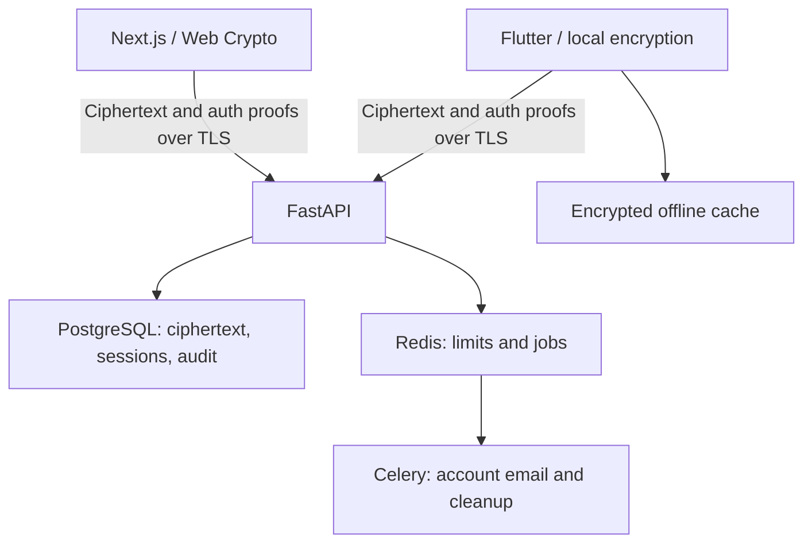

# VaultPass

A privacy-focused password and secrets workspace with a Next.js web client, Flutter mobile client, and ciphertext-only FastAPI sync service.

**Status: working personal vault plus team-vault protocol foundation, pre-release. Not independently audited or ready for production secrets.** Read [release readiness](docs/RELEASE_READINESS.md) for actual checks and the remaining product/security work. This repository does not claim that the full requested product roadmap is complete.

## Implemented

- Client-side Argon2id, separated HKDF authentication/wrapping keys, random account/vault keys, AES-256-GCM envelopes with contextual authentication.
- Registration, master-password plus passkey MFA login, rotating refresh tokens with replay revocation, session/device revocation, email verification, password change, optional zero-knowledge recovery key, account deletion.
- Login, note, card, identity, API credential, recovery-code and developer-secret records. Specialized fields currently use encrypted notes/custom text.
- Local search, folders/tags, favorites, trash, encrypted revision history, explicit conflict rejection, idempotent retries, paginated sync.
- Password generation, local short/reused-password checks, RFC 6238 TOTP, opt-in k-anonymity breach checking.
- Encrypted JSON backup, local restore into a vault, local JSON import.
- Recipient-encrypted read-only snapshots with expiry and revocation; fingerprint comparison is required before sending.
- Zero-knowledge team-vault API with Owner/Admin/Member/Read-only authorization, seven-day invitations, editable ciphertext sync and atomic member-removal key rotation. Web cryptographic primitives and tests are present; team management UI and mobile support remain unfinished.
- Responsive light/dark web application with local-only tokens, inactivity/background locking and nonce-based CSP.
- Flutter online registration/login, encrypted offline cache and edit queue, conflict preservation, local search, TOTP, device management, Android device-authenticated key storage and screenshot protection.
- PostgreSQL/Alembic, Redis rate limiting, bounded request/resource quotas, trusted-host enforcement, Celery transactional email and retention cleanup, Docker Compose, GitHub Actions, CodeQL, dependency scanning.

The mobile client and web client deliberately share an interoperable cryptographic protocol. Flutter currently uses the web client for backup/import, sharing, email verification and password/account changes.

## Architecture



See [security architecture](docs/SECURITY_ARCHITECTURE.md), [threat model](docs/THREAT_MODEL.md), [data classification](docs/DATA_MODEL_SECURITY.md), and [sync protocol](docs/SYNC.md).

## Run locally

Requirements: Docker Engine with Compose v2. Mobile: current Flutter stable and Android SDK/JDK 17.

```bash
git clone https://github.com/The-Null-Catchers/VaultPass.git
cd VaultPass
cp .env.example .env
docker compose up --build -d
```

- Web: http://localhost:3000
- API/OpenAPI: http://localhost:8000/docs
- Development email inbox: http://localhost:8025

Register a new account with a unique master password. Use synthetic data while evaluating. Request verification from Settings and copy its token from Mailpit. PostgreSQL and Redis have no public ports. Services wait for migrations before starting the API.

Passkeys work on `localhost` during local development. For an HTTPS deployment, set `WEBAUTHN_RP_ID` to the bare domain (for example `vault.example.com`) and `WEBAUTHN_ORIGIN` to its exact origin (for example `https://vault.example.com`) before enrolling credentials. Changing either value invalidates authentication with credentials enrolled for the old relying party.

To test Flutter against the host API, temporarily publish the API port to your emulator network (local machine only), then:

```bash
cd mobile
flutter pub get
flutter run --dart-define=API_URL=http://10.0.2.2:8000
```

Android cleartext transport is enabled only in debug builds. Release clients reject non-HTTPS endpoints.

## Develop without Docker

```bash
python3.12 -m venv .venv
. .venv/bin/activate
pip install -r backend/requirements.lock
pip install -e 'backend[dev]'
cd backend
# Set DATABASE_URL and REDIS_URL to running local PostgreSQL/Redis instances.
alembic upgrade head
uvicorn app.main:app --reload --no-access-log
```

In a second terminal:

```bash
cd web
npm ci
npm run dev
```

The web proxy uses `API_INTERNAL_URL` (default `http://localhost:8000`). All web API calls are same-origin; mobile calls the API directly, or the deployed web `/api` prefix.

## Tests

```bash
cd backend
pytest -q
ruff check app tests
ruff format --check app tests
mypy app
pip-audit -r requirements.lock
alembic upgrade head
alembic check

cd ../web
npm ci
npm test
npm run typecheck
npm run lint
npm run build
npm audit --omit=dev

cd ../mobile
flutter pub get
dart format --output=none --set-exit-if-changed lib test
flutter analyze
flutter test
```

Backend unit/security tests use an isolated SQLite database and substitute the Redis limiter; dedicated rate-limiter tests verify rejection and fail-closed behavior. CI separately runs PostgreSQL migrations. These distinctions matter: unit tests alone do not prove PostgreSQL concurrency behavior.

## Android artifacts

The Flutter CI job uploads a **debug-signed test APK** and an **unsigned release AAB**. Set repository variable `VAULTPASS_API_URL` to your HTTPS API base (for the web proxy, `https://your-domain/api`). Without it, builds point to `https://vaultpass.example.invalid` and cannot connect; this is deliberately not a fake working backend.

```bash
cd mobile
flutter build apk --debug --dart-define=API_URL=https://your-domain/api
flutter build appbundle --release --dart-define=API_URL=https://your-domain/api
```

AABs require your externally managed production signing pipeline before Play submission. Signing credentials are never committed. Do not mistake a successful artifact build for device/biometric certification or release readiness.

## Repository layout

```text
backend/app/          Models, validated envelopes, authentication, sync and sharing
backend/migrations/   Alembic versioned schema
backend/tests/        Authorization and session-security tests
web/src/app/          Responsive vault UI and same-origin API proxy
web/src/lib/          Crypto, backup, sharing, TOTP and generator tests
mobile/lib/           Flutter UI, interoperable crypto and encrypted offline store
mobile/test/          Crypto, locked-state widget and offline-queue tests
docs/                 Threat model, protocols and release evidence
deploy/               Reverse-proxy configuration
.github/workflows/    Backend, web, Flutter, Docker and CodeQL checks
```

## Configuration and deployment

See [.env.example](.env.example) and [deployment guide](docs/DEPLOYMENT.md). Never deploy development SMTP or database passwords. Do not expose the database, Redis, queue or mail inbox publicly.

## Demo and screenshots

Import [the fake JSON template](docs/import-template.json) from web Settings. Every value is synthetic and marked as such. Screenshots should be made with this isolated demo account; never capture real vault data. The UI supports desktop/mobile layouts, dark mode, generator, security activity and device views. No team-vault screenshot is presented because the management UI is not implemented yet.

## Security reporting

See [SECURITY.md](SECURITY.md). A compromised web delivery server or endpoint can steal secrets after unlock; zero-knowledge database storage cannot prevent malicious JavaScript delivery, OS malware, clipboard observers, or a recipient retaining a shared copy.
