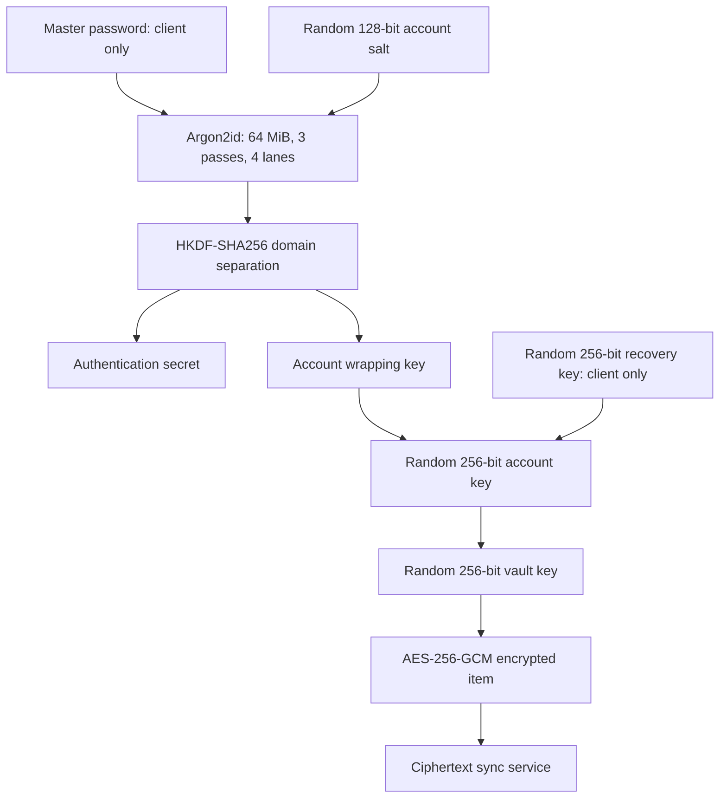

# Security architecture — protocol v1

Status: implemented protocol requiring independent review before real-secret deployment. This is an application protocol using established primitives, not a new cryptographic algorithm, PAKE or formal proof.

## Hierarchy

### Derivation

Argon2id v1.3 takes the UTF-8 master password without Unicode normalization, a 16-byte CSPRNG salt, m=65536 KiB, t=3, p=4, and produces 32 bytes. This is the 64 MiB profile described in [RFC 9106](https://www.rfc-editor.org/rfc/rfc9106.html). Clients reject unsupported profiles instead of accepting server-chosen low parameters or unbounded memory costs. Profile upgrades require explicit protocol migration; this release does not silently tune costs per device.

HKDF-SHA256 uses the Argon2 result as input key material, 32 zero bytes as extraction salt, and UTF-8 info `vaultpass:v1:wrap` or `vaultpass:v1:auth`. The two 32-byte outputs have independent purposes. Authentication proof is hex encoded and transmitted over TLS. The server stores its Argon2id hash, not the proof. The proof is password-equivalent **for authentication**, but is not a vault decryption key. This is not OPAQUE/SRP; a captured proof or encrypted key wrapper enables offline master-password guessing, subject to Argon2 costs. Strong master passwords are essential.

### Wrapping and encryption

Account and vault keys are independently generated CSPRNG 32-byte values. All encryption uses AES-256-GCM, a fresh random 12-byte nonce, and a 16-byte tag. Envelopes are `{v:1, nonce:base64, ciphertext:base64(ciphertext || tag)}`. Ciphertext is treated as opaque by the API. The server cannot cryptographically prove that a malicious client submitted encrypted data; first-party clients always encrypt before sending.

Authenticated data is exact UTF-8:

| Object | AAD |
| --- | --- |
| Account key | `vaultpass:v1:account:<user UUID>` |
| Vault key | `vaultpass:v1:vault:<user UUID>:<vault UUID>` |
| Item revision | `vaultpass:v1:item:<vault UUID>:<item UUID>:<revision>` |
| Sharing private key | `vaultpass:v1:sharing-private:<user UUID>` |
| Shared snapshot | `vaultpass:v1:share:<share UUID>:<sender UUID>:<recipient UUID>` |
| Team key (RSA-OAEP label) | `vaultpass:v1:team-key:<team UUID>:<member UUID>:<key epoch>` |
| Team item | `vaultpass:v1:team-item:<team UUID>:<item UUID>:<key epoch>:<revision>` |
| Recovery-wrapped account key | `vaultpass:v1:recovery:<SHA-256 recovery context>` |

UUIDs use lower-case canonical representation; revisions are base-10 integers. Binding revision and object context prevents moving a ciphertext to another item/vault/revision. Full history rollback by a malicious server remains possible without external trusted checkpoints. Random GCM nonces have a nonzero collision probability; key rotation and per-key usage limits remain release-hardening work. Do not use one vault key for unbounded bulk encryption.

### Password change

After recent password proof verification, the client generates a new salt, derives new wrapping/authentication keys, and re-encrypts the same account key. Server updates the bundle and authentication hash atomically and revokes all sessions. Vault/item ciphertext stays unchanged. Old backups and offline caches remain decryptable with their old master password: changing a password cannot revoke already copied ciphertext and keys.

### Key lifetime

Web keys and bearer/refresh tokens are in process memory only. Reload/logout/background/inactivity discards the unlocked application. Byte arrays are zeroed where feasible; JavaScript/Dart strings and cryptographic runtime copies cannot promise reliable zeroization. Decrypted React/Flutter state and clipboard values exist in memory while unlocked. No analytics or remote fonts are included.

Mobile persists encrypted envelopes and queued ciphertext in an atomically replaced private file. Refresh tokens use platform secure storage. Optional Android account-key persistence uses `AndroidOptions.biometric(enforceBiometrics:true)` with a separate storage namespace; OS biometric/device credentials are required. Android API 28+ is required. This protects the stored key, rather than merely hiding a UI behind a local-auth prompt. Physical-device verification of invalidation/re-enrollment remains outstanding. iOS biometric unlock is intentionally unsupported; master-password offline unlock is available, with refresh tokens protected by a this-device-only Keychain accessibility policy.

### Authentication and requests

Opaque CSPRNG access tokens expire after 15 minutes. Refresh tokens expire with their 30-day device session, rotate once, and persist as SHA-256 digests. A used token replay revokes the family and current access token. Access authorization checks database revocation on every request. Redis-backed rate limiting fails closed. There are no authentication cookies; bearer tokens must be explicitly attached, so CSRF cannot authenticate requests via ambient cookies. Mutating cross-origin requests are additionally denied, and CORS has an explicit allowlist.

Mutating request streams are bounded independently of `Content-Length`; an oversized declared length is rejected before reading and chunked bodies cannot bypass the cap. JSON/envelope fields have independent limits. Host headers are checked against an operator allowlist. Vaults are capped at 5,000 persistent item identities (including purge tombstones), accounts at 20 active sessions and 10 passkeys by default. Concurrent issuance/enrollment is serialized on the owning database row. When a new login exceeds the session cap, the least-recently-used active session is revoked; expired sessions and challenges are deleted by the scheduler. Audit metadata defaults to 365-day retention and can be shortened only to 30 days.

When at least one passkey is enrolled, a correct master-password-derived authentication proof starts a five-minute WebAuthn challenge but does not issue a session. The server requires a valid assertion for an enrolled credential, the configured relying-party ID and exact origin, the one-time challenge, and authenticator user verification before issuing tokens. Credential signature counters, backup state and last-use time are updated after verification. Multiple credentials are supported. Enrollment requires an authenticated session plus a fresh master-password proof, and each challenge is purpose/user/session-bound as applicable. Credential private keys remain inside the authenticator; the server stores only credential IDs, COSE public keys and operational metadata.

Passkeys are account MFA, not vault encryption keys: the master password is still required to derive the account wrapping key locally. A passkey alone cannot decrypt ciphertext. Production must use HTTPS and set `WEBAUTHN_RP_ID` and `WEBAUTHN_ORIGIN` before enrollment. Losing every enrolled authenticator requires the separate recovery-key flow; successful recovery deliberately removes enrolled passkeys as well as revoking sessions.

### Sharing

Web Crypto generates a per-user RSA-OAEP 3072-bit keypair with SHA-256. Public SPKI bytes are server-visible; private PKCS8 bytes are AES-GCM encrypted under the account key. Initial publication is immutable in this release. Key rotation is not implemented and must not be emulated by overwriting the directory.

A share is a read-only snapshot encrypted under a fresh 32-byte random key. That key is RSA-OAEP wrapped for the recipient, with label `vaultpass:v1:share-key:<share UUID>:<sender UUID>:<recipient UUID>`. Sender/recipient/share IDs are authenticated in the payload too. Expiry is 1–30 days at the API; UI defaults to 7. Both accounts must verify email. Before sending, compare SHA-256 of the SPKI with the recipient over a separately trusted channel. A checkbox records the user's confirmation, not an automated cryptographic identity guarantee. There is no key-transparency log or sender digital signature in v1. A compromised directory or malicious recipient can still affect authenticity; verify out of band.

Revocation removes future ciphertext/key downloads and does not erase already saved plaintext or ciphertext/key material. The recipient may explicitly save a separate personal copy.

### Team vaults

A team has a client-generated random 256-bit key and a monotonically increasing key epoch. That key is RSA-OAEP wrapped separately for each member's immutable sharing public key; the server stores only the wrappers, roles and relationship metadata. Team item AES-GCM AAD binds team, item, key epoch and revision. The server enforces Owner, Admin, Member and Read-only roles on every team route. Only the owner may invite, promote or remove administrators.

Invitations expire within seven days and carry a recipient-specific wrapper for the current epoch. Acceptance is serialized with team mutation. A key rotation invalidates every outstanding invitation, because its wrapper belongs to the old epoch.

Removing a non-owner is deliberately inseparable from rotation. The initiating owner/admin opens a one-hour rotation job, then uploads each remaining member wrapper and each replacement item ciphertext independently, so request-size limits do not constrain the whole vault. Staging does not change membership or visible ciphertext. Finalization locks the team and job, requires the exact remaining membership and retained-item sets, rechecks the key epoch and every item revision, then advances the epoch, replaces wrappers/ciphertext, deletes old-key revision history, removes the member and revokes invitations in one transaction. Concurrent item edits make finalization fail until those items are restaged; an expired or cancelled job cascades all staged ciphertext.

The backend can verify completeness, authorization and freshness but cannot prove that opaque client submissions contain the correct key or plaintext. Already copied old plaintext, ciphertext and keys cannot be revoked. Owner transfer and owner-only deletion APIs are implemented without changing the team key because membership confidentiality is unchanged by transfer; the web management UX, a safe self-leave workflow that preserves removal rekey guarantees, and mobile support remain unimplemented.

### TOTP and breach checks

Vault TOTP seeds are encrypted item fields; the backend never verifies or receives those seeds in plaintext. This is **not account MFA**. RFC 6238 SHA-1/30-second/6-digit codes are generated locally. Web official test vectors cover 8-digit RFC examples. Account MFA uses WebAuthn/passkeys. Server-validated TOTP MFA was deliberately not added because it would require a server-readable shared seed and violate the stated TOTP-secret boundary.

Breach checking requires explicit consent per check. The client sends 5 hexadecimal characters of a SHA-1 hash (20 bits), its network IP and ordinary request headers to `api.pwnedpasswords.com`, requests padding, and matches remaining suffixes locally. No full password/hash is uploaded. SHA-1 here is only for the published lookup protocol, not password storage. See [HIBP documentation](https://haveibeenpwned.com/API/v3#PwnedPasswords).

### Recovery and backups

There is no server-side master-password recovery. A user may explicitly enroll a client-generated 256-bit recovery key. HKDF-SHA256 separates `recovery-wrap` and `recovery-auth` material. The wrap key encrypts the existing account key locally using AES-GCM; only that envelope and an Argon2id hash of the independent authentication proof reach the server. The displayed `VP1-<64 hex>` recovery key is never transmitted or stored by VaultPass.

Recovery lookup always returns the deterministic SHA-256 context for the supplied normalized email and a syntactically valid envelope, including for unknown or unenrolled accounts. Successful local decryption produces the recovery proof. After proof verification the API issues a single five-minute reset token and reveals the user UUID needed to bind a newly wrapped account bundle. Completion atomically replaces authentication material, revokes all sessions, removes passkeys and pending WebAuthn challenges, deletes the recovery enrollment, and consumes the reset token. The same account key continues to unlock existing vault keys, so items are not re-encrypted. The user must enroll and save a new recovery key and re-enroll passkeys afterward. Possession of a recovery key is equivalent to the ability to reset authentication and decrypt the vault; copied keys cannot be remotely revoked until the enrollment is disabled or consumed.

Encrypted backups contain the account bundle, wrapped vault key, and item ciphertext; the original backup master password is required to restore. Restore decrypts locally and encrypts new copies under the destination vault. Trash is excluded from restore in v1. Losing the master password, recovery key, and previously enabled device unlock means losing the vault.

## Libraries and review

Web: hash-wasm Argon2id, browser Web Crypto and the browser WebAuthn API. Mobile: PointyCastle Argon2id and `cryptography` AES-GCM/HKDF/HMAC. Backend: argon2-cffi for proof hashing and py_webauthn for challenge/attestation/assertion verification. Library use does not establish that this integration is audited. Cross-client vectors, tamper tests, official TOTP vectors, WebAuthn virtual-authenticator coverage and authorization tests are necessary but insufficient for production assurance.
